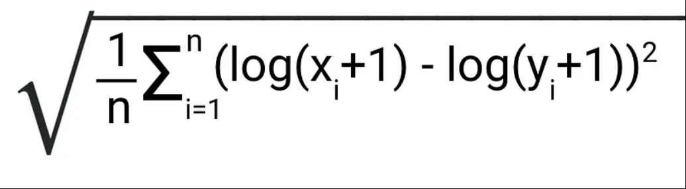

# Abalone Age Prediction - Kaggle Playground Series (Season 4, Episode 4) 🐚🔮

## Introduction 🌊

This competition invites you to explore the fascinating world of abalones and test your machine learning prowess. By predicting the age of abalones accurately, you'll unlock insights into these marine mollusks and their growth patterns.

## **Objective** 🎯

Your mission is to develop robust machine learning models capable of accurately predicting the age of abalones based on their physical attributes.

## **Evaluation** 📊

Your submissions will be evaluated using the **Root Mean Squared Logarithmic Error (RMSLE)** metric. This metric ensures your predictions are as close as possible to the true values while penalizing large errors.

<div align='center' >
    
</div>

## Dataset 📦

The dataset for this competition includes various physical measurements of abalones, such as length, diameter, height, and weight. These features serve as valuable indicators of abalone age.

## Files 📄

- **train.csv**: Training dataset containing abalone measurements and their corresponding ages.
- **test.csv**: Test dataset for which you need to predict the abalone ages.
- **sample_submission.csv**: A sample submission file demonstrating the correct format for predictions.

## Installation & Usage 💻

Follow these simple steps to get started:

1. **Clone the Repository**: 
    ```bash
    git clone https://github.com/yashksaini-coder/Abalone-age-prediction
    ```

2. **Navigate to the Repository Directory**:
    ```bash
    cd Abalone-age-prediction
    ```

3. **Install Dependencies**:
    ```bash
    pip install -r requirements.txt
    ```

**Explore the dataset, develop your machine learning models, and submit your predictions through the Kaggle competition platform before the deadline.**

## Dependencies 🛠️

- Python 3.9
- Data manipulation libraries (e.g., Pandas, NumPy)
- Machine learning libraries (e.g., Scikit-learn, TensorFlow, PyTorch)

---

### 🐚✨ **Author**:-
### [Linkedin](https://www.linkedin.com/in/yashksaini/)
### [GitHub](https://github.com/yashksaini-coder)

